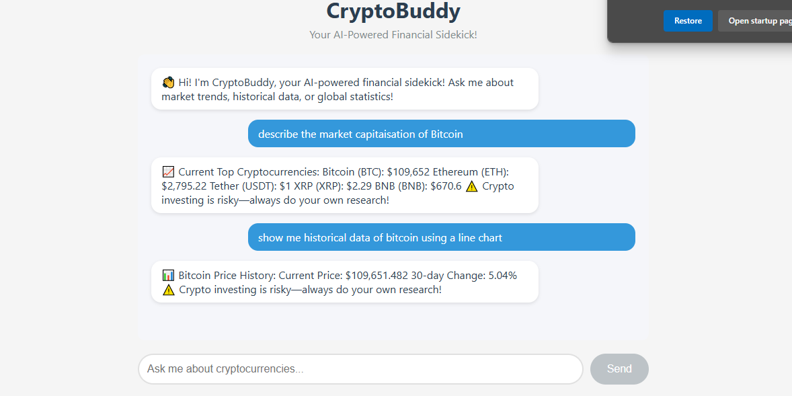

# CryptoBuddy - Your AI-Powered Financial Sidekick!

CryptoBuddy is a rule-based chatbot that provides cryptocurrency investment advice based on predefined data. It offers insights about trending, sustainable, and profitable cryptocurrencies.

## Live Demo
Check out the live application: [CryptoBuddy](https://cryptobuddy-frontend.onrender.com/)

## Screenshots

### Homepage


### Start Page


## Features

- Clean, modern chat interface
- Real-time responses to cryptocurrency queries
- Information about trending cryptocurrencies
- Sustainable cryptocurrency recommendations
- Profitable cryptocurrency suggestions
- Responsive design for all devices

## Prerequisites

- Node.js (v14 or higher)
- npm (v6 or higher)
- MongoDB Atlas account
- Render.com account

## Installation

1. Clone the repository:
```bash
git clone <repository-url>
cd cryptobuddy
```

2. Install dependencies for both frontend and backend:
```bash
npm run install-all
```

## Running the Application Locally

1. Start the development server:
```bash
npm run dev
```

This will start both the backend server (on port 5000) and the frontend development server (on port 3000).

2. Open your browser and navigate to:
```
http://localhost:3000
```

## Deployment on Render.com

### Backend Deployment

1. Create a new Web Service on Render.com
2. Connect your GitHub repository
3. Configure the service:
   - Name: `cryptobuddy-backend`
   - Environment: `Node`
   - Build Command: `npm install`
   - Start Command: `npm start`
4. Add Environment Variables:
   - `PORT`: 5000
   - `MONGODB_URI`: Your MongoDB connection string
   - `NODE_ENV`: production
5. Click "Create Web Service"

### Frontend Deployment

1. Create another Web Service on Render.com
2. Connect the same GitHub repository
3. Configure the service:
   - Name: `cryptobuddy-frontend`
   - Environment: `Node`
   - Build Command: `cd client && npm install && npm run build`
   - Start Command: `cd client && npm run start:prod`
4. Add Environment Variables:
   - `REACT_APP_API_URL`: Your backend Render URL
5. Click "Create Web Service"

## Usage

1. Type your questions about cryptocurrencies in the chat input
2. Ask about:
   - Trending cryptocurrencies
   - Sustainable cryptocurrencies
   - Profitable cryptocurrencies
3. Get instant responses with cryptocurrency recommendations

## Security

- Input sanitization is implemented to prevent XSS attacks
- CORS is enabled for secure cross-origin requests
- No sensitive data is stored or transmitted

## Disclaimer

⚠️ Crypto investing is risky—always do your own research! The advice provided by CryptoBuddy is based on predefined rules and should not be considered as financial advice.

## License

MIT License 

### Contributors:

**Lead Architect** : Cpt. Njenga